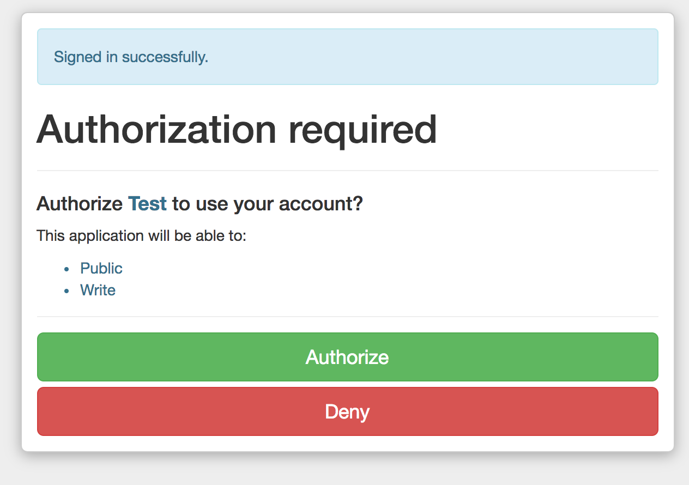

# Doorkeeper OAuth provider app

This is an example of a Rails 5.1 app acting as a OAuth provider for other apps. This is the same method that Google, Facebook and Twitter use to provide a "Login with Google" button. This example can be used in conjunction with the [Rails App as a OAuth Consumer](https://github.com/seanfcarroll/doorkeeper-client-rails-5.1).

## Setup provider

- clone this app
- bundle install
- bundle exec rake db:create
- rails s -p 3000

## Setup consumer

- clone the [client app](https://github.com/seanfcarroll/doorkeeper-client-rails-5.1)
- bundle install
- bundle exec rake db:create
- rails s -p 3001

## Configure provider

- visit http://localhost:3000/oauth/applications
- Add a new entry "Test"
- Configure the callback url as 
```http://localhost:3001/oauth/callback```

## Configure client

- Add the OAuth server address, app ID and secret to the client app's environment variables (config/local_env.yml)
- Set the callback url in the client app's environment variables (needs to be url encoded)
- Restart the client app

## Authorize client from Provider app

- visit ```http://localhost:3000/oauth/applications```
- Select 'TEST2'
- Click the authorize button


## Access client

- visit http://localhost:3001
- Click the "Authorize via Doorkeeper/Rails" link
- You will be presesnted with a Standard Devise login page. This is being served by the Provider app. Enter the log in credentials.
- Once authenticated, you will be presented with the Doorkeeper OAuth authority page (which can be customised), click "Authorize"
- You will then be redirected back to the authenticated view in the client app




